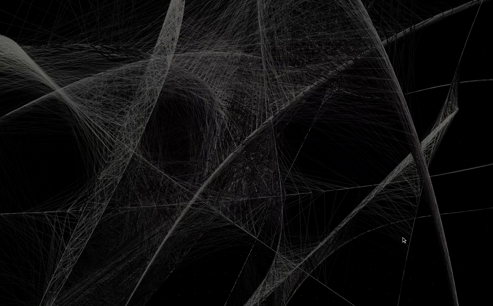

# Generative Drawing Application
 experimental drawing app with many features for live visual events, vjing, etc...

 - Target tracking mode
 - Auto-pilot: Generative drawing mode
 - Manual mode with a pointer device (computer mouse, touch device, etc...)

[Watch the video](https://youtu.be/lZecYsKw1qw)
  

  To do:
  - doumentation
  - video tutorial
  - sound responsive mode
  - line thickness support on GL3
  - Autopilot mode for color changing
  - Better lighting...
  - Camera tracking for framing
  - SVG export
  - FBO trailing effect?
  

 
